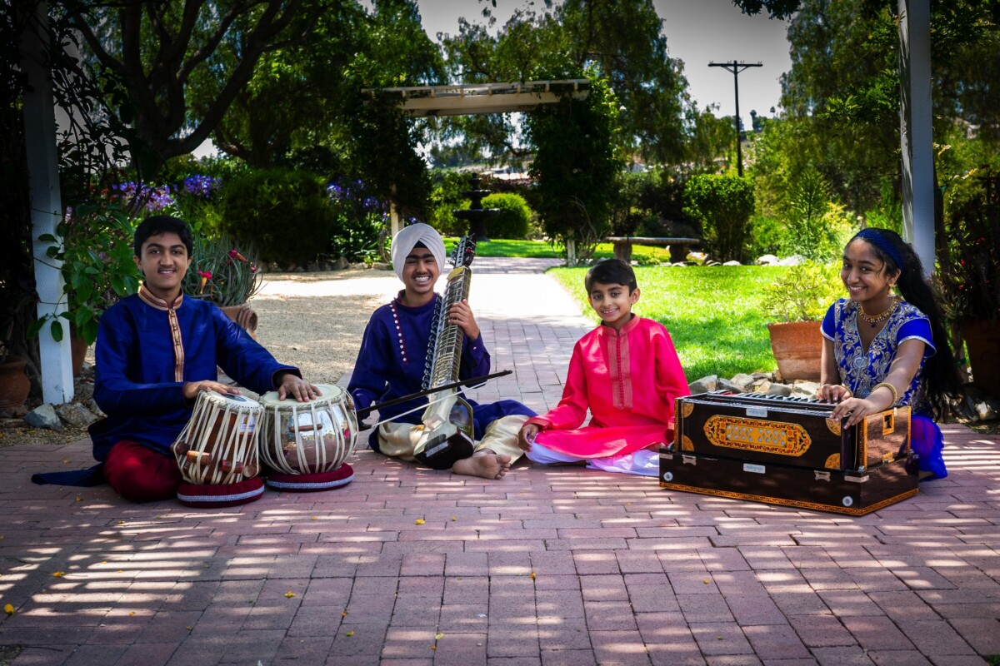

<!--  -->

# : Carnatic Music

### Introduction 
Carnatic music, rooted in South India, is one of the oldest classical music traditions, emphasizing intricate rhythms, melodic patterns, and improvisation. Its structure is based on *ragas* (melodic scales) and *talas* (rhythmic cycles), allowing for expressive depth and improvisational freedom. Key composers like Tyagaraja, Muthuswami Dikshitar, and Syama Sastri enriched its repertoire with spiritually inspired compositions. Typically accompanied by instruments like the *mridangam*, *veena*, and *violin*, Carnatic music celebrates devotion and technical virtuosity.

# This project contains :
    _ Carnatic History,
    _ Types of Ragas,
    _ How to lyrics Ragas,
    _ Breif Directions to learn Music
    _ Better Guider

### Why only Carnatic music
Carnatic music holds a unique appeal because of its deep-rooted cultural and spiritual essence, intricate rhythmic complexity, and profound focus on melody and devotion. Its compositions emphasize *bhava* (emotion), *rasa* (aesthetic experience), and *bhakti* (devotion), creating a spiritual connection. The improvisational scope in *alapana*, *kalpanaswara*, and *ragam tanam pallavi* sections allows for personal expression within traditional frameworks. Unlike other music forms, it maintains a singular focus on purity of form, discipline, and heritage, making it a compelling choice for those seeking depth and authenticity.

<!--  -->

|Name of Project|Date|Project- number|Developer|Languages|
|---|---|---|---|---|
|Carnatic World|03-11-2024|1|Group|Html , Css , js , Git

